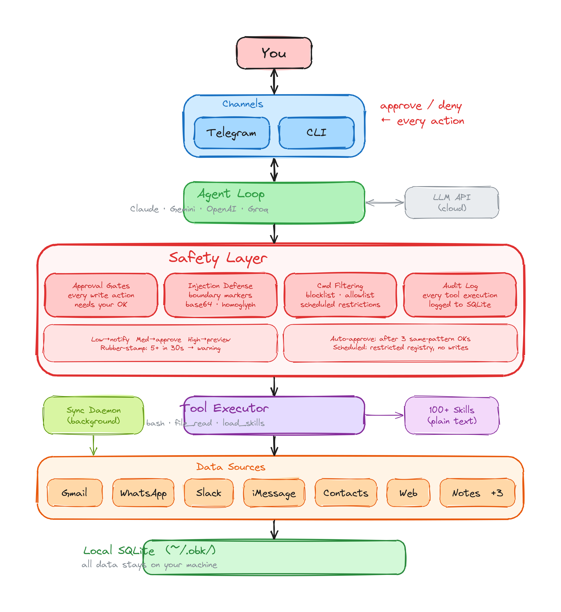

# OpenBotKit

A personal AI assistant that runs on your machine, connects to your email and messages, and **always asks before acting**.



## The Problem

AI agents can now read your email, send messages, and browse the web on your behalf. But most of them:

- Run autonomously with no approval flow — sending emails you didn't review
- Store your personal data on someone else's servers
- Get WhatsApp accounts blocked by spamming contacts without limits
- Operate as a black box — you can't see what they're doing

## How OpenBotKit Is Different

**Sensitive actions need your permission.** When the assistant wants to send an email, a WhatsApp message, or modify your calendar, it sends you a preview on Telegram with Approve and Deny buttons. You review it, you decide. This is enforced in code — the AI cannot skip this step. Read-only actions like searching your email or reading notes happen instantly without interrupting you.

**Your data stays on your device.** Emails, messages, notes, and contacts sync into SQLite databases on your machine. OpenBotKit connects directly to Gmail's API, WhatsApp's protocol, and Apple Notes. No cloud relay, no third-party middleware.

**Everything is transparent.** Every database query, every API call, every message draft — you can see it all. The assistant's skills are plain text files you can read in 30 seconds. The data is SQLite you can query with `sqlite3`.

## How It Works

1. Your data syncs locally from Gmail, WhatsApp, Apple Notes, and other sources
2. You talk to the assistant via Telegram or the terminal
3. The assistant reads your local data to answer questions — no approval needed
4. When it wants to **send a message, email, or modify your calendar**, it asks for your approval first
5. You approve or deny — then it acts

## Integrations

| Source | What it does |
|--------|-------------|
| **Gmail** | Read, search, and send emails. OAuth2 authentication. |
| **WhatsApp** | Read and send messages. Native protocol, QR code linking. |
| **Apple Notes** | Search and read notes on macOS. |
| **iMessage** | Read iMessage conversations on macOS. |
| **Contacts** | Search your address book by name. |
| **Web Search** | Search the web using multiple backends. No API keys needed. |
| **Slack** | Read channels and send messages. |
| **Scheduler** | Create scheduled tasks and reminders. |

| Channel | How you interact |
|---------|-----------------|
| **Telegram** | Chat with your assistant + approve/deny actions with buttons |
| **Terminal** | Direct CLI interaction for power users |

## Quick Start

### 1. Install

**macOS and Linux** (Windows is not supported):

```bash
curl -fsSL https://raw.githubusercontent.com/73ai/openbotkit/master/install.sh | sh
```

<details>
<summary>Alternative: build from source</summary>

Requires [Go 1.25+](https://go.dev/dl/).

```bash
git clone https://github.com/73ai/openbotkit.git
cd openbotkit && make install
```
</details>

### 2. Set up your sources

```bash
# Guided setup — walks you through sources, models, and Telegram
obk setup

# Check what's connected
obk status
```

<details>
<summary>Alternative: manual setup</summary>

```bash
obk config init
obk gmail auth login && obk gmail sync
obk whatsapp auth login && obk whatsapp sync
obk telegram setup
```
</details>

### 3. Start your assistant

```bash
# Start the assistant
cd assistant && claude

# Or use Telegram as your interface
obk agent start
```

Ask things like:

- *"What emails did I get today?"*
- *"Tell David I'll be 10 minutes late"* → sends via WhatsApp after your approval
- *"Draft a reply to the invoice email from yesterday"* → shows draft on Telegram, you approve
- *"Search the web for flights to Bangkok next week"*
- *"Remind me to call the dentist tomorrow at 9am"*

## Safety

Safety is not a feature — it's the foundation. OpenBotKit has 8 defense layers:

1. **Approval gates** — Sensitive write actions (send email, send message, modify calendar) require explicit approval, enforced in code. The AI cannot bypass this.
2. **Local-first data** — Your data lives in SQLite on your machine. Nothing leaves unless you send it.
3. **Prompt injection defense** — Content boundaries, injection scanning (plain text, base64, homoglyph), and system prompt hardening.
4. **Tiered risk levels** — Low-risk actions notify you. Medium-risk actions need approval. High-risk actions need approval with full preview.
5. **Bash command filtering** — Dangerous commands are blocked. Scheduled tasks only allow `obk` and `sqlite3`.
6. **Rubber-stamp detection** — If you approve too many actions too quickly, the system warns you to slow down.
7. **Restricted unattended mode** — Scheduled tasks get fewer tools and no file write access.
8. **Audit logging** — Every tool execution is logged locally. You can review what happened anytime.

Read the full safety architecture: [`docs/safety.md`](docs/safety.md)

## Architecture

OpenBotKit is a single Go binary. No bloated frameworks, no 200-dependency packages.

| Component | What it does |
|-----------|-------------|
| **Sources** | Data connectors for Gmail, WhatsApp, Apple Notes, iMessage, Slack, Contacts, Web |
| **Sync engine** | Background daemon (launchd/systemd) keeps your local data fresh |
| **CLI** (`obk`) | Search, read, and send across all sources from the terminal |
| **Agent** | Built-in agent loop with tool use, safety gates, and multi-LLM support |
| **Skills** | 100+ plain-text skill definitions that the agent loads on demand |
| **Channels** | Telegram bot and CLI for interaction; Telegram for approval flow |

### Supported LLM Providers

- Anthropic Claude (default)
- Google Gemini
- OpenAI
- OpenRouter
- Groq

## Data Directory

All data lives under `~/.obk/` (override with `OBK_CONFIG_DIR`):

```
~/.obk/
├── config.yaml
├── gmail/
│   ├── data.db             # Synced emails
│   └── attachments/        # Downloaded attachments
├── whatsapp/
│   └── data.db             # Synced messages
├── applenotes/
│   └── data.db             # Synced notes
├── history/
│   └── data.db             # Conversation history
├── user_memory/
│   └── data.db             # Personal memory
└── audit/
    └── data.db             # Audit log
```

## Platform Support

| Platform | Status |
|----------|--------|
| **macOS** (Apple Silicon & Intel) | Fully supported — all features including Apple Contacts, Notes, iMessage |
| **Linux** (amd64 & arm64) | Supported — server deployment, all features except Apple-native integrations |
| **Windows** | Not supported |

## Prerequisites

- macOS or Linux
- Gmail: API credentials from [Google Cloud Console](https://console.cloud.google.com/apis/credentials)
- WhatsApp: Phone with WhatsApp to scan QR code
- Telegram: Bot token from [@BotFather](https://t.me/botfather) (for approval flow)

## Contributing

OpenBotKit is open source. Read the code, open issues, send pull requests.

## License

MIT
