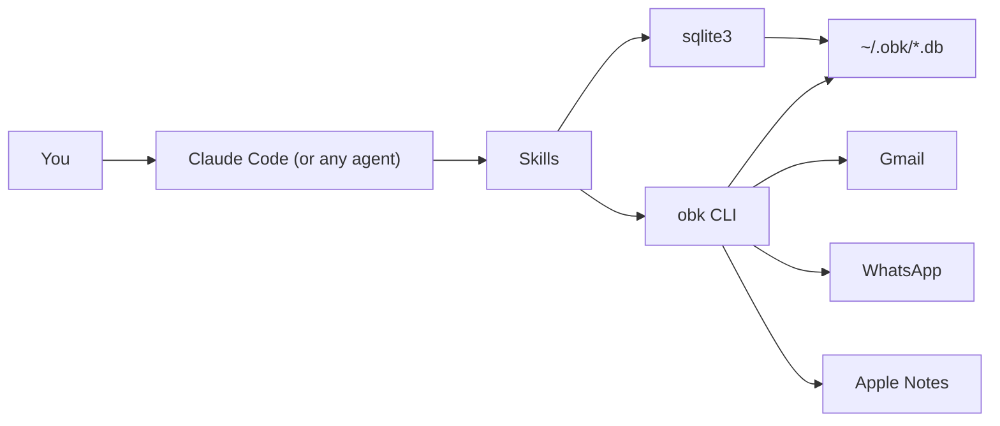

# OpenBotKit

A DIY kit for building your own AI assistant. Runs on your machine, talks to your data, answers to you.

## Why

AI assistants today have a real problem. They get access to your email, messages, and files, then run autonomously in the background. They hallucinate. They act on wrong assumptions. They send things you didn't mean to send. And you can't see what they're doing because the whole thing is a black box running on someone else's servers.

We think the fix is pretty simple: **safety**, **no slop**, and **more control**.

### Safety

The assistant runs through Claude Code. You see every database query, every message it sends, every command it runs. You approve it or you don't. There are no autonomous loops running behind your back. If the assistant wants to email someone or message a contact, you're in the loop before it happens.

Your data syncs into local SQLite databases on your machine. Nothing leaves your device unless you explicitly send it. `obk` connects directly to Gmail's API, WhatsApp's protocol, and Apple Notes on your Mac. No relay server, no cloud middleware, no third-party backend sitting between you and your data.

### No slop

The AI assistant space is full of slop. Bloated agent frameworks. Magic tool-calling you can't inspect. 200-dependency packages that break every other week. "AI-powered" wrappers that add latency and nothing else.

OpenBotKit is a single Go binary. Your data lives in SQLite files you can query yourself with `sqlite3`. Every skill the assistant uses is a plain text file with SQL patterns and CLI commands. You can read the whole thing in 30 seconds. There's no hidden complexity.

### More control

Think of it like a meal kit instead of a pre-made meal. You get the ingredients (data connectors, a sync engine, a local database, a CLI, and assistant scaffolding) and you put it together yourself. You pick which sources to connect. You pick what the assistant can access. You can modify any skill, write new ones, or rip out what you don't need. If you don't like how something works, you change it.

## What's in the kit

| Component | What it does |
|---|---|
| **Sources** | Connectors for Gmail, WhatsApp, Apple Notes, and conversation history |
| **Sync engine** | Background daemon (launchd/systemd) keeps your local data fresh |
| **CLI** (`obk`) | Search, read, and send across all sources from the terminal |
| **Assistant scaffolding** | Pre-configured Claude Code setup with skills for natural-language access |

## Install

```bash
go install github.com/priyanshujain/openbotkit@latest
```

Or build from source:

```bash
git clone https://github.com/priyanshujain/openbotkit.git
cd openbotkit && make install
```

## Quick Start

```bash
# Guided setup: pick your sources, authenticate, run first sync
obk setup

# Or configure manually:
obk config init
obk gmail auth login          # OAuth2 browser flow
obk gmail sync
obk whatsapp auth login       # scan QR code
obk whatsapp sync

# Check what's connected
obk status
```

## How it works



## Building Your Assistant

The `assistant/` directory is a ready-to-use Claude Code workspace with skills wired to your synced data.

```bash
ln -s /path/to/openbotkit/assistant ~/assistant
cd ~/assistant && claude
```

From there you can ask things like:

- *"Do I have any unread emails from Stripe?"*
- *"Tell David I'll be 10 minutes late"* (sends via WhatsApp)
- *"Draft a reply to the invoice email from yesterday"*
- *"What did we discuss about the API redesign last week?"*
- *"Find my notes about the Berlin trip"*

Each skill is just a plain text file with SQL patterns and CLI commands. You can read them, change them, or write your own. No magic. See [`assistant/`](assistant/) for setup details.

## Data directory

Config and all synced data live under `~/.obk/` (override with `OBK_CONFIG_DIR`). Run `obk config show` to see your current configuration.

```
~/.obk/
├── config.yaml
├── gmail/
│   ├── credentials.json    # Google OAuth client creds
│   ├── tokens.db           # OAuth tokens
│   ├── data.db             # Synced emails
│   └── attachments/        # Downloaded attachments
├── whatsapp/
│   ├── session.db          # WhatsApp session
│   └── data.db             # Synced messages
├── applenotes/
│   └── data.db             # Synced notes
├── history/
│   └── data.db             # Conversation history
└── user_memory/
    └── data.db             # Personal facts about the user
```

## Prerequisites

- macOS (OpenBotKit is built with macOS as the primary target)
- Go 1.25+
- Gmail requires API credentials from [Google Cloud Console](https://console.cloud.google.com/apis/credentials)
- WhatsApp requires scanning a QR code to link your phone

## License

MIT
